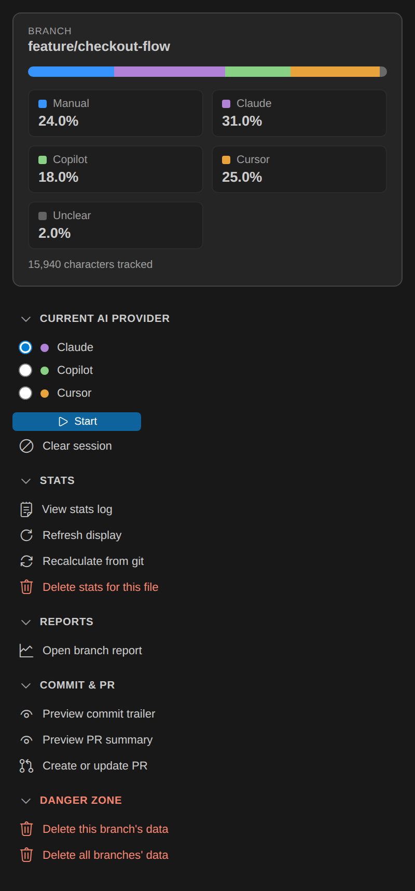
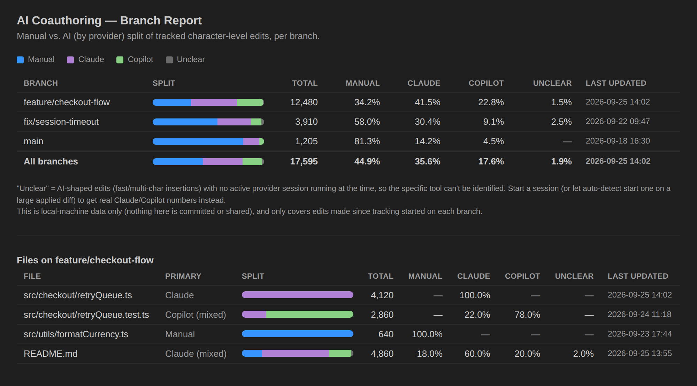
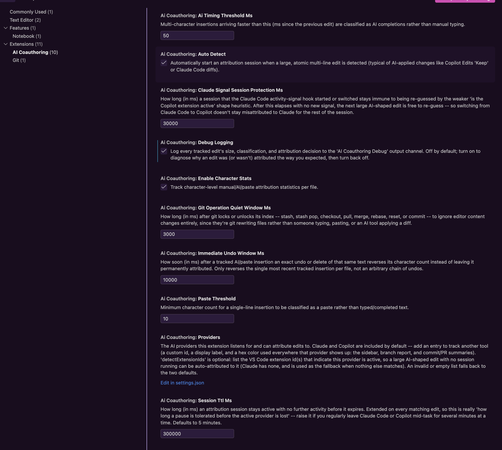
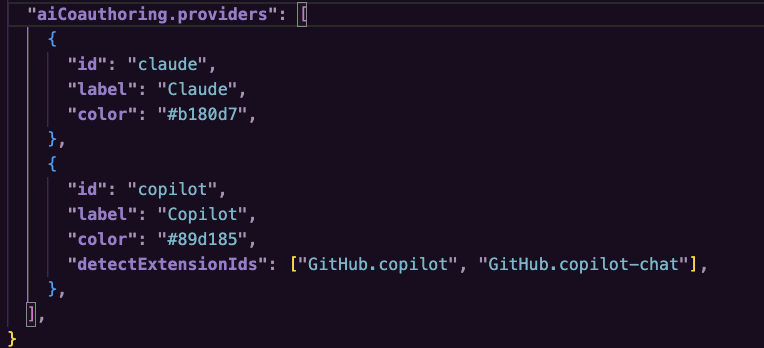

# AI Co-Authoring Tracker

A VS Code extension that tracks AI-assisted edits in a Git repository — locally, per branch, no telemetry — and turns that into commit trailers, PR summaries, and always-visible stats. Claude and GitHub Copilot are tracked by default; add any other AI tool via `aiCoauthoringTracker.providers`.

**Repository:** [0xC0DEM4M4N/vscode-extension-ai-coauthoring-tracker](https://github.com/0xC0DEM4M4N/vscode-extension-ai-coauthoring-tracker) · **Version:** 0.0.43

## Highlights

✓ **Per-branch, entirely local** — no telemetry, no server. Every number lives under your repo's own `.git` directory and never leaves your machine.

✓ **Claude and Copilot, by name — or any provider you add** — not just "AI happened here," but which tool, tracked live in the status bar and a dedicated sidebar panel. The two defaults cover most people out of the box, and `aiCoauthoringTracker.providers` lets you track anything else (Cursor, Windsurf, a local model) with its own label and color.

✓ **Session integrity you can trust** — once a provider is genuinely detected, nothing silently overwrites it with a weaker guess. A repo-wide signal or a size-shaped heuristic can start a session when none is running, but it can never hijack one that's already active.

✓ **Survives git operations** — stash, stash pop, checkout, pull, merge, and rebase are recognized and never mistaken for a manual paste or an AI-applied diff.

✓ **Deleted and stashed files don't skew your numbers** — a file's stats step out of every total the moment it's missing and step back in the moment it reappears, with nothing ever lost.

✓ **Commit trailers and PR summaries, automatically** — an `AI-Coauthoring:` trailer with `Co-authored-by:` lines on every commit, and a refreshed attribution block in your PR description.

## What this does

While you work, the extension classifies every character you type or paste as manual, AI-completion, or paste-shaped, and — when it knows which AI tool you're using — attributes AI/paste characters to that specific provider (`claude`, `copilot`, or any other you've configured). That data feeds four things:

- An `AI-Coauthoring:` trailer (with `Co-authored-by:` lines) added automatically to every commit, e.g. `manual=6% claude=34% copilot=60%`.
- An AI-attribution summary block posted into the pull request description when you open or update a PR.
- A live status bar readout and a sidebar panel, both showing the current branch's manual/AI-by-provider split as you type.
- A cross-branch HTML report comparing every branch's split at a glance.

Everything is computed and stored on your machine, under the repo's own `.git` directory. Nothing is sent anywhere, and none of it is committed to the repo.

## Screenshots

*(sample data shown below -- branch/file names and numbers are illustrative, not real)*

**Sidebar panel** -- a live summary of the current branch plus every command, grouped and one click away. The Current AI Provider section lists a radio button per configured provider plus a compact **Start** button; this example has a third, custom "Cursor" provider added via `aiCoauthoringTracker.providers` alongside the Claude/Copilot defaults, to show how the summary card, stat tiles, and provider list all scale automatically to whatever you configure:



**Branch report** -- every branch's split side by side, plus a per-file breakdown of the current branch showing which provider wrote each file:



## How it works

The extension keeps a short-lived **attribution session** (5 minutes by default, refreshed on activity, configurable via `aiCoauthoringTracker.sessionTtlMs`) tagged with a provider. A session is what lets the extension say "Claude" or "Copilot" specifically, instead of just "AI" — see "What the data means" below for what happens when no session is active. Claude and Copilot are configured by default, but the list of providers the extension listens for (and the color each one is drawn in) is configurable via `aiCoauthoringTracker.providers` — see "Adding or customizing providers" under Settings below.

A session starts in one of two ways:

- **Manual** — in the sidebar panel's Current AI Provider section, pick a provider from the radio list and press **Start** (the play icon); or run `AI Co-Authoring Tracker: Start/Switch Provider Attribution`, or pick one from the status bar (bottom-left).
- **Automatic** — the extension watches for large, atomic, multi-line text changes: 2+ lines or 200+ characters applied in a single edit event. This is the pattern produced by AI tools applying a diff (Copilot Edits "Keep", Copilot Chat "Apply", or VS Code reloading a file after Claude Code's CLI edits it on disk), as opposed to a human typing incrementally.

An AI-shaped edit updates attribution immediately, **regardless of the current status bar state**: if no session is active, one auto-starts (guessing `copilot` if the Copilot extension is active, otherwise `claude`). If a session is already active, the edit writes under that session's provider rather than re-guessing — **except** for a session the Claude Code activity-signal hook backed (see below), once its evidence has gone stale (`aiCoauthoringTracker.claudeSignalSessionProtectionMs`, default 30s): after that, the next AI-shaped edit is free to re-guess, so switching from Claude Code to Copilot doesn't stay misattributed to Claude for the rest of the session. A manual choice, or a session the shape heuristic guessed on its own, is never re-guessed regardless of how much time passes — only a claude-signal-backed session's protection expires.

Automatic detection is a heuristic, not a guarantee — it can occasionally misfire on a large manual paste or refactor, and it can't distinguish `claude` from `copilot` with certainty. Use the manual commands or the status bar/sidebar picker to correct or override it at any time.

**For Claude Code specifically, there's a more precise path than the shape heuristic above.** A small, global Claude Code CLI hook (installed automatically — see "Automated setup" below) writes a timestamped record of exactly which file Claude Code just touched. When that record names a file you actually have open, it's trusted as real evidence of what just happened — not a guess — so it can correctly attribute even a small Claude Code edit that wouldn't otherwise meet the 2-line/200-character shape threshold, and it can switch a running session’s provider when Claude Code is genuinely still the one editing. It only ever acts on signals recent enough to be trustworthy and never overrides a *newer* manual or auto-detected choice you've made since.

Because the shape heuristic and the signal watcher run on separate, independent triggers, the edit that prompts a signal can occasionally already be recorded under the wrong bucket a few milliseconds *before* the signal arrives to correct the session (the shape heuristic auto-detecting "copilot" from environment alone, then the signal arriving moments later with real evidence it was actually Claude Code). When that happens, the signal doesn't just fix the session going forward — it reattributes that specific edit's already-recorded characters to the right bucket too.

## How to install

**Prerequisites:**

- The workspace's first folder must be a Git repository — attribution data is written under its `.git` directory.
- **Node.js must be on `PATH`.** The commit hooks (and the "Preview Commit Attribution Trailer" command) shell out to `node`. If it isn't found, the hooks no-op silently — they never block a commit — and the preview command shows an explicit error instead.
- **[GitHub CLI (`gh`)](https://cli.github.com/) must be installed and authenticated** (`gh auth login`) — but only for the PR-summary feature. The extension shells out to `gh` to read and update pull request descriptions, and there's no way to install or authenticate it on your behalf. If it's missing on activation, you'll get a one-time warning; everything else (sessions, character stats, commit trailers) works fine without it.

**Install the extension:**

1. Download the latest `.vsix` from the [`install/`](./install/) folder.
2. In VS Code: Command Palette (`Ctrl+Shift+P` / `Cmd+Shift+P`) → `Extensions: Install from VSIX...` → choose the file.
3. Reload VS Code.

To build a fresh `.vsix` from source instead:

```bash
npm install
npm run build-install
```

This compiles the extension, packages it with `vsce`, and moves the resulting `.vsix` into `install/`. See [install/README.md](./install/README.md) for keeping it as a repo-recommended install (VS Code's `extensions.json` only supports Marketplace IDs, not local VSIX files, so this is a documented manual step instead).

**First-run hook install:** on activation, if the repo doesn't already have `core.hooksPath` set to `.githooks`, you'll be prompted to install AI Co-Authoring Tracker's git hooks. Accepting:

1. Refuses to run if `core.hooksPath` is already set to something else (Husky, lefthook, ...), so it never silently disables another tool's hooks — it prints the two lines you'd add to your existing hooks instead (see "How the data is used" below).
2. Otherwise copies the hook scripts into `.githooks/` and points `core.hooksPath` at it — a local, per-repo git config value, so this is never committed.
3. Adds `.githooks/` to *your* global git ignore (`git config --global core.excludesFile`) and hides it from VS Code's Explorer/search via your global `files.exclude`/`search.exclude` settings. Both are personal, machine-local preferences — the repo's own `.gitignore` and workspace `.vscode/settings.json` are never touched, so nothing here is pushed onto other contributors.

You can decline the prompt and run `scripts/ai-coauthoring-install/install-hooks.sh` manually later, or trigger the prompt again by running any `AI Co-Authoring Tracker:` command.

**Claude Code activity-signal hook (automated, global, one-time):** separately from the per-repo git hooks above, on first activation the extension also offers to register a small Claude Code CLI hook — this is what gives it precise "Claude Code just touched this exact file" detection (see "How it works"). Unlike the git hooks, this is installed **once per machine, in your global `~/.claude/settings.json`**, not per-repo — accept it once and it covers every repository you open from then on, and every teammate who installs this extension gets the same prompt, so nobody has to hand-edit JSON themselves. Concretely, accepting it:

1. Copies `scripts/ai-coauthoring-install/claude-signal-hook.js` to `~/.claude/ai-coauthoring/claude-signal-hook.js` — kept in sync with the extension's own copy automatically on every activation, so an extension update rolls out to it without you doing anything.
2. Adds one entry to your global settings' `hooks.PostToolUse` array pointing at that script. This **merges in**, not overwrites: any hooks you already have (for other tools, or other matchers) are left exactly as they were, and every other top-level key in your settings (`attribution`, `permissions`, ...) is untouched. If that file exists but isn't valid JSON, the extension refuses to touch it at all rather than risk clobbering it — you'll get an error telling you to fix or back it up first.

You can decline the one-time prompt and install it later (or re-run it, e.g. after fixing a malformed settings file) via `AI Co-Authoring Tracker: Install Claude Code Activity Hook`, also available as a button in the sidebar's Help section. Declining just means Claude Code detection falls back to the shape heuristic alone — everything else in the extension still works.

## How to use it

**Start a session** so AI/paste characters get attributed to a specific provider: in the sidebar panel's Current AI Provider section, select a provider from the radio list and click **Start**; pick one from the status bar (bottom-left); run `AI Co-Authoring Tracker: Start/Switch Provider Attribution`; or just accept a large AI-applied diff and let auto-detect start one for you. A session lasts 5 minutes from your last edit by default, refreshing on activity -- raise `aiCoauthoringTracker.sessionTtlMs` if you regularly leave Claude Code or Copilot mid-task for longer than that.

**Check your stats at a glance:**

- The **status bar** (bottom-right) shows the live split for the current branch, e.g. `Manual 6% | AI 94% (Claude 34% · Copilot 60%)`. Hover for exact counts and the branch name; click to open a full per-file breakdown.
- The **sidebar panel** — click the sparkle icon in the Activity Bar (far left) — pins the same current-branch summary at the top (a live stacked bar plus a Manual / one tile per configured provider / Unclear stat grid), always visible. Below it, every command in the extension is grouped into collapsible sections (Current AI Provider / Stats / Reports / Commit & PR / Danger zone / Help) as one-click buttons — Current AI Provider starts expanded, the rest tuck away until you need them. It shows a radio button per configured provider (pre-selecting whichever one is currently active, if any) plus a **Start** button, rather than a separate button per provider. The Help section has a short sample workflow if you want a quick refresher.
- The **"AI Attribution Stats" Explorer view** lists a branch-total row plus one row per tracked file, with character counts and percentages (hover a row for the Claude/Copilot/unclear split).
- `AI Co-Authoring Tracker: Show Branch Report` opens an HTML page with two tabs: **Branches** compares every branch's split side by side, so you can see the whole repo's history at a glance rather than just the branch you're on; **Files** breaks the *current* branch down file by file -- which provider actually touched each one, not just the branch-wide total.

**Commit trailers happen automatically** once hooks are installed — nothing to run. Use `AI Co-Authoring Tracker: Preview Commit Attribution Trailer` any time to see exactly what your *next* commit would get, without committing anything.

**For pull requests**, run `AI Co-Authoring Tracker: Preview PR Attribution Summary` first (entirely local, no `gh` calls) to see what block would be posted, then create the PR from the panel or Command Palette when you're ready — creating shows a confirmation dialog. Once the PR exists, its description refreshes automatically after each push.

See "Commands" and "Settings" below for the full reference.

## Where to find the data

Everything lives under the repo's own `.git` directory — never committed, never shared, local to your clone only — scoped per branch:

| Path | What it holds |
| --- | --- |
| `.git/ai-attribution/<branch>/state.json` | The current/most recent attribution session for this branch: provider, files touched, timestamp. |
| `.git/ai-attribution/<branch>/char-stats.json` | Per-file manual/`byProvider`/unknown character counts for this branch — the source of truth for the status bar, sidebar panel, Explorer view, and branch report. |
| `.git/ai-attribution/<branch>/commit-snapshot.json` | A snapshot of `char-stats.json`'s totals taken after each commit, used to compute the *delta* for the next commit's trailer. |
| `.git/ai-attribution-stats.json.migrated` | Present only if you're upgrading from an older version of this extension: your old repo-wide (pre-branch-scoped) stats file, renamed here (not deleted) after being migrated into a `(legacy, unscoped)` row, visible in the branch report. |

Branch names containing `/` (e.g. `feature/foo`) are stored as nested directories under `.git/ai-attribution/`. Switching branches (`checkout`/`switch`) is detected automatically by watching `.git/HEAD` — the status bar, sidebar panel, and Explorer view all update to reflect whichever branch you land on, with no reload needed.

## What the data means

Every insertion is classified as it happens:

- **Manual** — a single typed character, or an Enter press (with or without auto-indent).
- **AI** — a multi-character insertion arriving faster than `aiCoauthoringTracker.aiTimingThresholdMs` (default 50ms) since the previous edit — the pattern of an inline completion being accepted.
- **Paste** — a multi-line insertion, or any single-line insertion at or above `aiCoauthoringTracker.pasteThreshold` characters (default 10) — the pattern of a clipboard paste or an applied AI diff.

This is a heuristic, inspired by [TraceAI](https://marketplace.visualstudio.com/items?itemName=traceai-team.traceai) (roughly 80–90% accurate per its own numbers) — it can't inspect VS Code's internal completion APIs, so fast manual typing can occasionally be misclassified as AI.

**AI and paste characters are then attributed to `claude` or `copilot` only if a session is active at that moment** (see "How it works"), including one just auto-started by that same edit. If no session is active — say, a quick inline completion accepted with no manual session running and auto-detect's larger thresholds not met — those characters land in an honestly-labeled **"unclear"** bucket rather than a guess. If you want real per-provider numbers (and a commit trailer that names Claude or Copilot specifically), keep a session running rather than relying only on ambient ghost-text completions.

**Deletions are not attributed to anything by default** — a removal has no character to classify, so it's silently ignored and whatever was previously counted for that text stays counted. There is one deliberate exception: if you undo (`Ctrl+Z`) or select-and-delete **the exact text from your most recent tracked insertion**, within `aiCoauthoringTracker.immediateUndoWindowMs` (default 10s), that insertion's count is reversed — accept a suggestion, immediately realize it's wrong, undo it, and it's as if it never happened. This only ever reverses the single most recent tracked insertion, matched exactly by position/length/document, not an arbitrary chain of undos — keep an AI-inserted block around for a while, edit near it, then delete it later, and it stays counted, since at that point you interacted with it. Set `aiCoauthoringTracker.immediateUndoWindowMs` to `0` to disable reversal entirely. (This also stops a large undo from being mistaken for a large AI diff being *applied* and spuriously auto-starting a session — see "How it works.")

**A file that doesn't currently exist on disk is excluded from every total** — deleted, or just temporarily stashed away. Its recorded stats aren't deleted from the underlying `char-stats.json`, so nothing is lost: the moment the file comes back (you undo the delete, switch to a branch that still has it, or pop the stash), it counts again automatically, unchanged. This applies to the status bar, sidebar panel, Explorer view, branch report, commit trailer, and PR summary alike.

**Git operations that rewrite files are not tracked as edits.** Stashing, popping a stash, checking out a branch, pulling, merging, and rebasing all briefly lock git's index (`.git/index.lock`); for `aiCoauthoringTracker.gitOperationQuietWindowMs` afterward (default 3s), any editor content change is ignored outright rather than being misread as a paste or an AI-applied diff. This is a time window, not a precise "this exact operation is running" check, so it can occasionally swallow a real edit made in the same instant as a git operation, or (rarely, for a very slow operation) miss part of one — but it's a large improvement over treating every stash pop as a multi-thousand-character paste.

**Discarding a file's uncommitted changes rolls its stats back, not just its content.** A moment after a git operation settles (stash pop, `git checkout -- <file>`, `git restore <file>`, or "Discard Changes" in the Source Control view), any tracked file whose content is back to exactly matching your last commit has its live stats checked against that commit's baseline. If the live stats are still counting more than the baseline — the only way that can happen is that some uncommitted AI/manual work just got thrown away — they're rolled back to exactly that baseline. Nothing that was already part of a previous commit is ever erased, only the discarded uncommitted portion. This needs a per-file baseline recorded at commit time, so it only takes effect from your next commit onward; a file with no baseline yet (or on a branch you haven't committed to since updating) is left alone rather than risking a wrong rollback.

**Different numbers measure different windows over the same data**, which is worth knowing before comparing them:

- The status bar, sidebar panel, Explorer view, and branch report all show the branch's **full locally-tracked total** since tracking started (or since your last reset).
- The commit trailer shows only the **delta since your last commit** on the current branch.
- The PR summary shows the branch's **full total**, same as the status bar — not scoped to exactly the PR's diff.

None of this is an audited measurement of a diff — treat it as "what this machine locally observed," not ground truth.

## How the data is used

### Commit trailers

Once hooks are installed (see "How to install"), every commit gets an `AI-Coauthoring:` trailer computed from the character stats recorded since your last commit on the current branch:

```
Fix the pagination bug

AI-Coauthoring: manual=6% claude=34% copilot=60%
Co-authored-by: Claude <noreply@anthropic.com>
Co-authored-by: GitHub Copilot <copilot@github.com>
```

How the delta is computed: `post-commit` snapshots the branch's current totals to `commit-snapshot.json` after every commit; `prepare-commit-msg` diffs the *current* totals against that snapshot. If nothing was tracked since the last commit, **no trailer is added at all** — it never fabricates a `manual=100%` out of the absence of data. Merge commits are skipped entirely, and amending a commit (`git commit --amend`) won't duplicate the trailer.

**The Copilot email is a placeholder.** GitHub has no official bot identity for Copilot commit co-authorship, so `GitHub Copilot <copilot@github.com>` is a guess that may not render as a linked account. Override either provider's address — or the minimum share a provider needs before it gets a `Co-authored-by:` line at all (default: any nonzero amount) — with an optional `.ai-coauthoring.json` at the repo root:

```json
{
  "coauthors": {
    "claude": "Claude <noreply@anthropic.com>",
    "copilot": "GitHub Copilot <your-preferred-address@example.com>"
  },
  "minPercentForCoauthor": 5
}
```

This file is plain JSON, committed to the repo (not under `.git/`), so a team can agree on it once.

**Using another hook manager?** (Husky, lefthook, pre-commit, ...) `install-hooks.sh` refuses to touch `core.hooksPath` if it's already set to something else. Add these two lines to your own `prepare-commit-msg` and `post-commit` hooks instead:

```bash
node "$(git rev-parse --show-toplevel)/scripts/ai-coauthoring-install/attribution-hook.js" prepare-commit-msg "$1" "${2:-}" "${3:-}" || true
node "$(git rev-parse --show-toplevel)/scripts/ai-coauthoring-install/attribution-hook.js" post-commit || true
```

### Pull request summaries

Separate from commit trailers, `AI Co-Authoring Tracker: Create/Update Pull Request with AI Attribution` posts a summary of the *whole branch's* locally tracked attribution into the pull request description — useful because GitHub only shows `Co-authored-by:` avatars per-commit, with nothing equivalent at the PR level.

The panel shows **Create PR** when the branch has no open PR, and **Update PR description** once it does (the Command Palette also has `Create Pull Request with AI Attribution`, `Update PR Description with AI Attribution`, and the combined `Create/Update...` command that picks whichever applies).

- **Create PR** (`gh pr create`, after a confirmation dialog) titles the PR from the branch's most recent commit subject, with the attribution block as the body. It refuses if an open PR already exists.
- **Update PR description** (`gh pr edit`) inserts or refreshes a delimited block rather than duplicating it. Everything else in the description (a summary you wrote, a test plan checklist, ...) is left untouched. It never creates a PR.
- **Automatic update on push:** once a PR exists, every successful push of the current branch (from the terminal, VS Code, or any git client) refreshes that PR's attribution block automatically, with no prompt. This is **update-only** — if the branch has no open PR, nothing happens and no PR is ever created automatically. Turn it off with `aiCoauthoringTracker.autoUpdatePrOnPush`: `false`.

The block looks like:

```markdown
<!-- ai-coauthoring:start -->
## 🤖 AI Co-Authoring Tracker Attribution

_Character-level split of edits on `feature/pagination-fix`, tracked locally by the AI Co-Authoring Tracker VS Code extension. This is local-machine data, not an audited measurement -- see the [extension's README](https://github.com/0xC0DEM4M4N/vscode-extension-ai-coauthoring-tracker/blob/main/README.md)._

| Manual | Claude | Copilot | Unclear |
| --- | --- | --- | --- |
| 6% | 34% | 60% | 0% |
<!-- ai-coauthoring:end -->
```

This is the one command in the extension that mutates GitHub (creates or edits a real PR), so it shows a confirmation dialog before doing anything, and requires `gh` (see "How to install"). Run `AI Co-Authoring Tracker: Preview PR Attribution Summary` first to see exactly what block would be inserted, entirely locally, with no `gh` calls and nothing sent to GitHub.

**Verification note:** the block-building and body-merging logic (creating vs. updating, replacing the block in place while preserving everything else in the description, argument-safe handling of commit titles with quotes/special characters) was tested against a mocked `gh`, plus a real end-to-end run of the commit hooks in a scratch repo — but the actual `gh pr create`/`gh pr edit` calls have not been exercised against a live GitHub repo. Sanity-check the first real run with the preview command first, rather than trusting it blind.

## Commands

| Command | Description |
| --- | --- |
| `AI Co-Authoring Tracker: Select Provider` | Opens a quick pick listing every configured provider and starts a manual session for the one you choose. |
| `AI Co-Authoring Tracker: Start/Switch Provider Attribution` | Starts (or switches) a manual session for a given provider. Invoked with an id from the sidebar's provider radio list; run from the Command Palette with no argument, it falls back to whichever provider auto-detect would have picked. |
| `AI Co-Authoring Tracker: Clear Attribution` | Ends the active session and deletes the current branch's session file. |
| `AI Co-Authoring Tracker: Show Character Stats` | Prints the full manual/Claude/Copilot/unclear breakdown for every tracked file on the current branch to an output channel. |
| `AI Co-Authoring Tracker: Reset Character Stats (Active File)` | Clears character-level stats for the file open in the active editor. |
| `AI Co-Authoring Tracker: Refresh Character Stats` | Re-renders the status bar, sidebar panel, and Explorer view from in-memory state -- does not recompute anything, just repaints the UI. |
| `AI Co-Authoring Tracker: Recalculate Stats (From Git)` | Recomputes tracked files against git: any file that's clean vs. `HEAD` but whose live stats still exceed its last-commit baseline gets rolled back (catches a Source Control discard the automatic watcher missed). Reports how many files, if any, were corrected. |
| `AI Co-Authoring Tracker: Show Branch Report` | Opens an HTML page with two tabs: a cross-branch manual/Claude/Copilot/unclear comparison (plus a combined total), and a per-file breakdown for the current branch showing which provider touched each file. |
| `AI Co-Authoring Tracker: Reset Attribution Data (Current Branch)` | **Destructive.** After a modal confirmation, permanently deletes character stats, session history, and the commit-attribution baseline for the current branch only. |
| `AI Co-Authoring Tracker: Reset ALL Attribution Data (Every Branch)` | **Destructive.** After a modal confirmation, permanently deletes character stats, session history, and commit-attribution baselines for every branch in the repository. |
| `AI Co-Authoring Tracker: Preview Commit Attribution Trailer` | Shows exactly what the `AI-Coauthoring:` trailer would say on your *next* commit, without committing anything. |
| `AI Co-Authoring Tracker: Preview PR Attribution Summary` | Shows exactly what the AI-attribution block would say in the current branch's PR description, without calling `gh`. |
| `AI Co-Authoring Tracker: Create Pull Request with AI Attribution` | **Mutates GitHub.** After a confirmation dialog, creates a PR for the current branch (refuses if one is already open), with an AI-attribution block in its description, via `gh`. |
| `AI Co-Authoring Tracker: Update PR Description with AI Attribution` | **Mutates GitHub.** Refreshes the attribution block in the current branch's open PR description (never creates a PR). Also happens automatically after each push. |
| `AI Co-Authoring Tracker: Create/Update Pull Request with AI Attribution` | Does whichever of the two above applies to the current branch. |
| `AI Co-Authoring Tracker: Toggle Debug Logging` | Turns the "AI Co-Authoring Tracker Debug" output channel on/off (see "What the data means"). |
| `AI Co-Authoring Tracker: Install Claude Code Activity Hook` | Installs or re-syncs the global Claude Code CLI hook (see "Automated setup" above). Safe to re-run any time -- a no-op if it's already installed and current. |

## Settings

| Setting | Default | Description |
| --- | --- | --- |
| `aiCoauthoringTracker.autoDetect` | `true` | Automatically start a session when a large atomic multi-line edit is detected. Set to `false` to rely on manual commands only. |
| `aiCoauthoringTracker.enableCharacterStats` | `true` | Track character-level manual/AI/paste attribution statistics per file. |
| `aiCoauthoringTracker.pasteThreshold` | `10` | Minimum character count for a single-line insertion to be classified as a paste. |
| `aiCoauthoringTracker.aiTimingThresholdMs` | `50` | Multi-character insertions faster than this (ms) are classified as AI completions. |
| `aiCoauthoringTracker.immediateUndoWindowMs` | `10000` | How soon (ms) after a tracked insertion an exact undo/delete of that same text reverses its character count. See "What the data means" above. |
| `aiCoauthoringTracker.sessionTtlMs` | `300000` (5 min) | How long an attribution session stays active with no further activity before it expires. Extended on every matching edit -- raise it if you regularly leave an AI tool mid-task for several minutes. |
| `aiCoauthoringTracker.providers` | Claude + Copilot (see below) | The list of AI providers the extension listens for and can attribute edits to. See "Adding or customizing providers" just below. |

### Adding or customizing providers

By default the extension tracks two providers:

```json
"aiCoauthoringTracker.providers": [
  { "id": "claude", "label": "Claude", "color": "#b180d7" },
  {
    "id": "copilot",
    "label": "Copilot",
    "color": "#89d185",
    "detectExtensionIds": ["GitHub.copilot", "GitHub.copilot-chat"]
  }
]
```

Like every setting here, it shows up in VS Code's own Settings UI (`Cmd+,` / `Ctrl+,`, then search "AI Co-Authoring Tracker") with its description and an "Edit in settings.json" link:



...or you can skip the UI and edit the array directly in `settings.json`:



To track another tool (Cursor, Windsurf, a local model, anything), add another entry to that array in your settings, e.g.:

```json
"aiCoauthoringTracker.providers": [
  { "id": "claude", "label": "Claude", "color": "#b180d7" },
  { "id": "copilot", "label": "Copilot", "color": "#89d185", "detectExtensionIds": ["GitHub.copilot", "GitHub.copilot-chat"] },
  { "id": "cursor", "label": "Cursor", "color": "#e8a33d" }
]
```

Each entry needs an `id` (stored in stats and commit trailers -- avoid renaming it once you have data recorded under it), a `label` (what's shown everywhere in the UI), and a `color` (a hex string, used for that provider's bars, swatches, and stat tiles across the sidebar, status bar, and branch report). `detectExtensionIds` is optional: list the VS Code extension id(s) that indicate this provider is active, so auto-detect can guess it for a large AI-shaped edit with no session running. A provider with no `detectExtensionIds` (Claude, by default) is used as the fallback when nothing else matches -- if you add a provider you want auto-detect to prefer over Claude, give it `detectExtensionIds` of its own.

You can also just **change the colors** of the two defaults by overriding the setting with the same two entries and different `color` values -- you don't have to add a third provider to use this.

Reordering or removing an entry only changes what the extension listens for and displays going forward; it doesn't touch characters already recorded under a provider id you removed (they just stop showing up in new-looking breakdowns since nothing currently active matches that id). An invalid or empty `aiCoauthoringTracker.providers` value falls back to the Claude + Copilot defaults above. The standalone git-hook script (commit trailers, PR summaries) doesn't read this setting at all -- it has no access to VS Code settings, so it just reports whichever provider ids actually have tracked data, using a capitalized version of the id as the label for anything it doesn't otherwise recognize.

---

## Contributing

```bash
npm install
npm run build   # compile TypeScript to out/
npm run watch   # recompile on change
npm run package # produces a .vsix via @vscode/vsce
```

To try it out:

1. Open this folder (`vscode-extension-ai-coauthoring-tracker/`) as its own VS Code workspace.
2. Press **F5** to launch an Extension Development Host (this runs `npm run build` first via the pre-launch task).
3. In the Extension Development Host, open a folder that is a Git repository.
4. Run one of the `AI Co-Authoring Tracker: …` commands from the Command Palette, or make a large multi-line edit and watch the status bar auto-update.
5. Check `.git/ai-attribution/<branch>/state.json` and `char-stats.json` in that repo to confirm attribution was recorded, or make a commit and look for the `AI-Coauthoring:` trailer.

### Testing checklist

Manual smoke test, run after any change to `src/extension.ts`:

1. **Extension activates** — in the Extension Development Host, confirm `AI Attr: Off` appears in the status bar (bottom left).
2. **Commands are registered** — `Cmd+Shift+P` → "AI Co-Authoring Tracker" should list every command in the table above.
3. **Manual session** — run `AI Co-Authoring Tracker: Start/Switch Provider Attribution` (or, in the sidebar, select Claude in the Current AI Provider radio list and press **Start**). Status bar should switch to `AI Attr: claude`; hovering shows the remaining TTL and reason.
4. **Attribution file write** — edit and save a tracked file, then run `cat .git/ai-attribution/<branch>/state.json` in that repo. Confirm `branch`, `filesByProvider.claude`, and the saved file's relative path appear.
5. **TTL expiry** — stop editing for 2+ minutes; status bar should revert to `AI Attr: Off` and the session should no longer track new edits until restarted.
6. **Clear command** — run `AI Co-Authoring Tracker: Clear Attribution`; status bar resets and `.git/ai-attribution/<branch>/state.json` is deleted.
7. **Provider accumulation** — start a Claude session, edit/save, then start a Copilot session and edit/save a different file. `.git/ai-attribution/<branch>/state.json` should list both providers and both files.
8. **Auto-detection from Off** — with no manual session active, paste or apply a multi-line block (2+ lines or 200+ characters) into a tracked file, or accept an AI tool's diff via its "Keep"/"Apply" action. The status bar should switch on its own (e.g. `AI Attr: copilot`) and a transient message should read "AI Co-Authoring Tracker: auto-detected … edit". Verify `.git/ai-attribution/<branch>/state.json` updates without running any command.
9. **Auto-detection fires regardless of prior typing** — type a few characters manually, then immediately (within ~1s) paste/apply a large multi-line block in the same file. Attribution should still update — recent manual typing no longer suppresses detection.
10. **Existing session isn't clobbered by shape alone** — start a manual session for Claude (sidebar radio list + **Start**, or `AI Co-Authoring Tracker: Start/Switch Provider Attribution`), then make a large AI-shaped edit. Attribution should still write under `claude` (the active session's provider), not silently switch providers.
11. **Setting toggle** — set `"aiCoauthoringTracker.autoDetect": false` in the dev host's settings, ensure no session is active, and repeat step 8; no session should auto-start until you use a manual command.
12. **Hook install prompt** — in a repo where `git config core.hooksPath` isn't `.githooks`, reloading the dev host should prompt to install hooks; accepting should run `scripts/ai-coauthoring-install/install-hooks.sh` without error, create `.githooks/`, and set `core.hooksPath`. In a repo where `core.hooksPath` is already set to something else (e.g. `.husky`), it should show an error explaining it refused to overwrite it, and `core.hooksPath` should be unchanged.
13. **Character stats classification** — type single characters slowly (should count as manual), paste a multi-line block (should count as paste), and simulate a fast multi-char insertion e.g. via an inline completion accept (should count as AI). Confirm the status bar (bottom right) percentage updates for each. With no session active, AI/paste chars should land in "unclear"; with a Claude or Copilot session active, they should land in that provider's bucket instead.
14. **Immediate undo reversal** — with a Claude or Copilot session active, accept a large (200+ char) AI-shaped insertion, then immediately `Ctrl+Z`. Confirm the status bar percentage and `char-stats.json` both revert as if the edit never happened, and that no "AI Co-Authoring Tracker: auto-detected …" message fires for the undo itself. Then repeat but wait longer than `aiCoauthoringTracker.immediateUndoWindowMs` (or lower the setting to make this quick) before undoing/deleting — confirm the count is now NOT reversed, since it's outside the immediate-undo window.
15. **Character stats persistence** — after making some edits, run `cat .git/ai-attribution/<branch>/char-stats.json`; confirm per-file `manual`/`byProvider`/`unknown` counts appear and update after further edits (allow ~1s for the debounce).
16. **Explorer view** — open the "AI Attribution Stats" view in the Explorer sidebar; confirm it shows a workspace total row plus one row per tracked file with character counts and percentages, and updates after new edits.
17. **Reset/refresh stats commands** — with a tracked file open, run `AI Co-Authoring Tracker: Reset Character Stats (Active File)`; confirm its entry disappears from `.git/ai-attribution/<branch>/char-stats.json` and the Explorer view. Run `AI Co-Authoring Tracker: Refresh Character Stats` and `AI Co-Authoring Tracker: Show Character Stats` and confirm they don't error.
18. **Branch scoping** — make some edits on branch A, note the status bar percentages, then `git checkout` branch B. The status bar and Explorer view should update automatically (no reload) to branch B's own data (likely "no data" the first time). Make edits on B, then switch back to A — A's earlier stats should still be there, unchanged by B's edits.
19. **Branch report** — with data on at least two branches, run `AI Co-Authoring Tracker: Show Branch Report`. Confirm an HTML tab opens on its "Branches Overview" tab, listing every branch with recorded data (each with a stacked manual/Claude/Copilot/unclear bar), and a combined "All branches" total row. Click the "Branch Files AI Breakdown" tab and confirm it switches to a "Files on <branch>" table listing every tracked file on the current branch with its own split and a "Primary" column naming whichever provider wrote most of it, then click back to "Branches Overview" and confirm it switches back. Run the command again and confirm it refreshes the same panel rather than opening a second one.
19a. **Custom provider end to end** — add a third entry to `aiCoauthoringTracker.providers` (e.g. `cursor`, a distinct color, no `detectExtensionIds`), reload the window, and confirm: the sidebar's summary card and Current AI Provider radio list both show a third tile/row for it in its configured color; selecting it and pressing **Start** switches the status bar to `AI Attr: cursor`; tracked edits show up under it in the branch report's bars, table columns, and legend; and its share appears in the commit trailer and PR attribution block using its configured label.
20. **Reset current branch (with warning)** — run `AI Co-Authoring Tracker: Reset Attribution Data (Current Branch)`. Confirm a modal dialog appears requiring explicit confirmation; cancelling it must leave all data untouched. Confirming should delete only the current branch's `char-stats.json`/`state.json` and clear the status bar/Explorer view for that branch, while other branches' data (verify via the branch report) is unaffected.
21. **Reset all branches (with warning)** — run `AI Co-Authoring Tracker: Reset ALL Attribution Data (Every Branch)`. Confirm a modal dialog appears; cancelling leaves all data untouched. Confirming should delete the entire `.git/ai-attribution/` directory and the branch report should then show no data.
22. **Commit trailer appears** — with hooks installed and some character stats tracked, make a commit. Confirm `git log -1 --format=%B` shows an `AI-Coauthoring: manual=…% claude=…% copilot=…%` line with `Co-authored-by:` lines for any provider with a nonzero share, and that `.git/ai-attribution/<branch>/commit-snapshot.json` updates to the new totals afterward.
23. **No trailer when nothing changed** — immediately make a second commit with no new tracked edits since the first. Confirm no `AI-Coauthoring:` trailer is added at all (not a `manual=100%` or any other fabricated value).
24. **Amend doesn't duplicate the trailer** — run `git commit --amend --no-edit` on a commit that already has a trailer. Confirm the trailer appears exactly once afterward.
25. **Preview command** — run `AI Co-Authoring Tracker: Preview Commit Attribution Trailer` before committing. Confirm the output channel shows what would be added (or an explicit "nothing tracked" message), matching what actually lands in the next real commit.
26. **Reset clears the commit baseline too** — run `AI Co-Authoring Tracker: Reset Attribution Data (Current Branch)`, then make new edits and a commit. Confirm the trailer reflects only the new edits (not stale, since `commit-snapshot.json` was also deleted by the reset).
27. **PR summary preview** — with some branch-level data tracked, run `AI Co-Authoring Tracker: Preview PR Attribution Summary`. Confirm the output channel shows the `<!-- ai-coauthoring:start -->...<!-- ai-coauthoring:end -->` block with correct percentages, and that no `gh` call was made (should work even with `gh` uninstalled).
28. **PR create** — on a branch with no open PR, confirm the panel's Commit & PR section shows **Create PR** (not Update). Click it: the modal confirmation appears, and after accepting, a new PR is created on GitHub with the attribution block in its description. Afterwards the button switches to **Update PR description**. Running **Create PR** again (Command Palette) should refuse because a PR already exists.
29. **PR update, preserving existing content** — on a branch that already has a PR (ideally one whose description has its own text above/below where the block will land), click **Update PR description** after tracking more edits. Confirm the description is updated in place: the block's numbers refresh, everything else is untouched, no second PR is created, and no confirmation dialog is needed.
30. **Automatic update on push** — on a branch with an open PR, track some more edits, commit, and `git push` (from the terminal or any git client). Within a few seconds the status bar briefly shows "AI attribution updated on PR" and the PR description's block refreshes on GitHub. Repeat with `aiCoauthoringTracker.autoUpdatePrOnPush` set to `false`: the push should leave the PR untouched.
31. **Push never creates a PR** — on a branch with NO open PR (or whose PR is merged/closed), push it. Confirm no PR is created and nothing on GitHub changes; the panel should still offer **Create PR**.
32. **Sidebar panel** — click the AI Co-Authoring Tracker icon in the Activity Bar. Confirm the summary at the top matches the status bar's current-branch numbers, and updates live as you make more tracked edits without needing to click anything. Click a few rows (e.g. "View stats log", "Open branch report") and confirm each runs the same command as its Command Palette equivalent. Switch branches and confirm the summary updates to the new branch without a reload.

If a step behaves unexpectedly, check the Debug Console in the host window (not the dev host) for exceptions thrown during activation or event handling.
